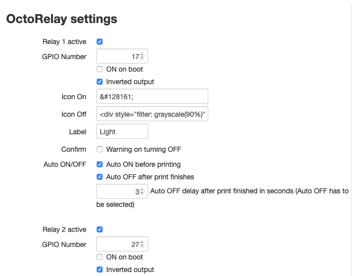
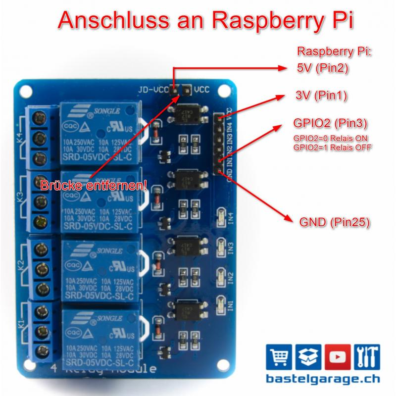
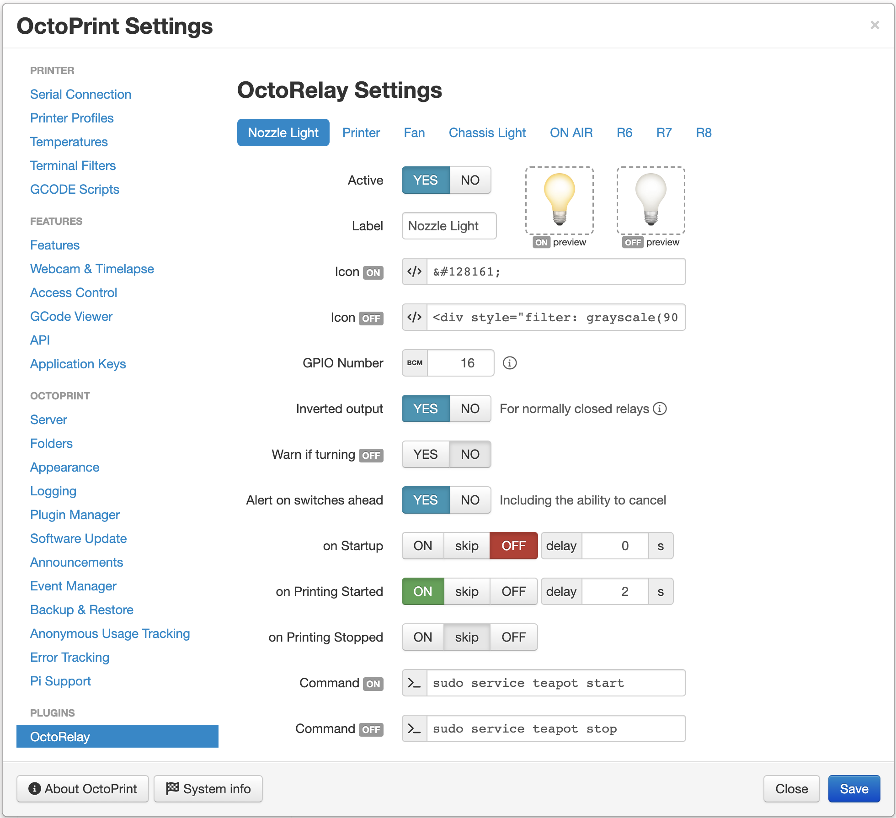

# OctoRelay

A plugin that adds buttons to the navigation bar to toggle GPIO pins on the Raspberry Pi.

This Plugin was based on the [Octolight Plugin](https://github.com/gigibu5/OctoLight) by Žiga Kralj, thanks ;-)

I use it with a 4 relay board, and printed this case for it:
https://www.thingiverse.com/thing:2975944

Just hooked up the GPIO pins with the relay board, and now I can turn the power of the printer,
the fan and the light on and off with OctoPrint.

## Setup

Install via the bundled [Plugin Manager](https://docs.octoprint.org/en/master/bundledplugins/pluginmanager.html)
or manually using this URL:

> https://github.com/borisbu/OctoRelay/archive/master.zip

In case you want to enable the plugin for user groups other than admins and users (operators), you need to 
grant them the permission "Relay switching" in the "Access control" section of OctoPrint settings.

## Configuration

Currently, OctoRelay supports up to 8 relays.
Each one has the following settings *(in order of appearance)*:

| Setting               | Description                                                |
|-----------------------|------------------------------------------------------------|
| Active                | Activates the relay and its control on the navigation bar  |
| Label                 | The HTML title of the icon in the navigation bar (hint)    |
| GPIO Number           | The GPIO pin on the Raspberry Pi *(see the picture above)* |
| Inverted output       | For normally closed relay: the relay is ON without power   |
| OS Command *(ON/OFF)* | An optional command to run when the relay state changes    |
| Icon *(ON/OFF)*       | An HTML tag to display on the navigation bar               |
| Confirmation          | Enables a confirmation dialog when turning the relay OFF   |
| ON initially on boot  | Turns the relay ON on start                                |
| ON before printing    | Turns the relay ON when started printing                   |
| OFF after printing    | Turns the relay OFF after finished printing                |
| Delay                 | Postpones turning the relay OFF for *X* seconds            |

## Updates

Check out the versions, their features and bug fixes in the [Changelog](CHANGELOG.md).
