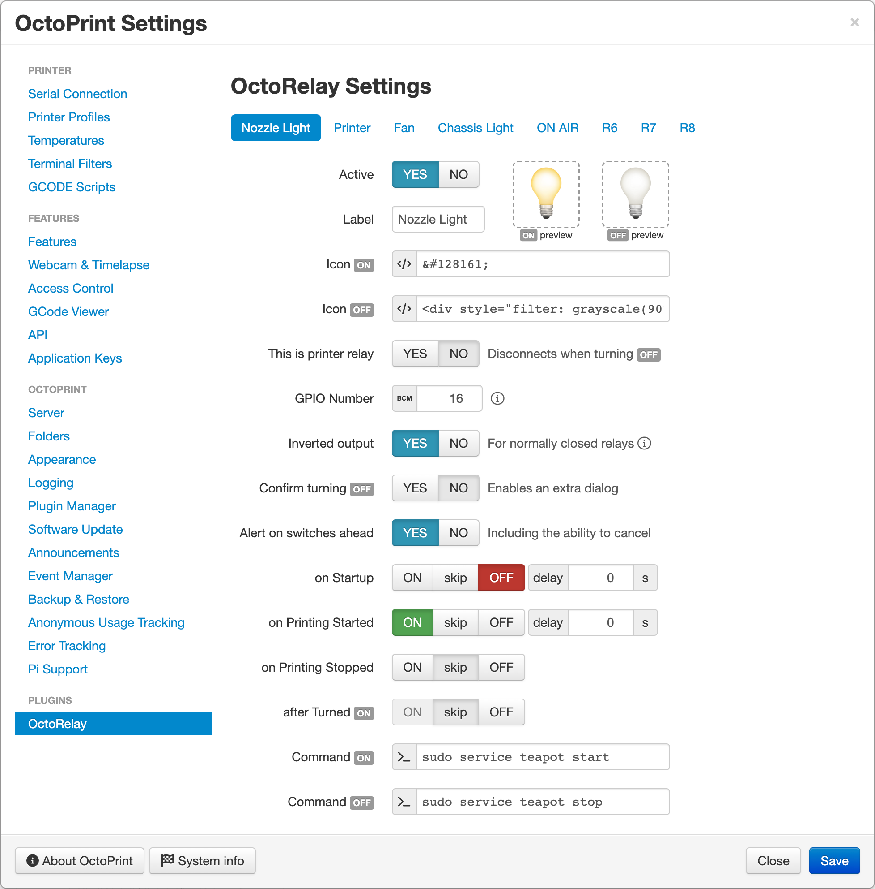

# OctoRelay

[](https://github.com/borisbu/OctoRelay/actions/workflows/CI.yaml)
[](https://github.com/borisbu/OctoRelay/actions/workflows/codeql.yml)
[](https://coveralls.io/github/borisbu/OctoRelay?branch=master)

The plugin adds buttons to the navigation bar for toggling GPIO pins on the Raspberry Pi.


> _I use it with a 4 relay board, and printed this
> [case for it](https://www.thingiverse.com/thing:2975944)._
> _Just hooked up the GPIO pins with the relay board, and now I can turn the
> power of the printer, the fan and the light on and off with OctoPrint._
>
> |  |  |
> |-----------------------------------------|----------------------------------------|
>
> _This plugin was based on the [OctoLight Plugin](https://github.com/gigibu5/OctoLight) by Žiga Kralj, thanks ;-)_
>
> — _Boris Burgstaller_

## Requirements

- Python: at least `3.7`,
- OctoPrint: at least `1.5.3`.
  - For [AutoConnect feature](https://github.com/borisbu/OctoRelay/blob/master/CHANGELOG.md#330): at least `1.9.0`.

## Setup

Install via the bundled [Plugin Manager](https://docs.octoprint.org/en/master/bundledplugins/pluginmanager.html)
or manually using this URL:

```
https://github.com/borisbu/OctoRelay/releases/latest/download/release.zip
```

In case you want to enable the plugin for user groups other than admins and users (operators), you need to
grant them the permission "Relay switching" in the "Access control" section of OctoPrint settings.

After installing the plugin you need to configure it in order to see the control buttons in the navigation bar.

## Configuration



Currently, OctoRelay supports up to 8 relays represented by the tabs on the top of the settings screen.
Each relay has the following settings *(in order of appearance)*:

| Setting               | Description                                                |
|-----------------------|------------------------------------------------------------|
| Active                | Activates the relay and its control on the navigation bar  |
| Label                 | The HTML title of the icon in the navigation bar (hint)    |
| GPIO Number           | The GPIO pin on the Raspberry Pi *(see the picture above)* |
| Inverted output       | For normally closed relay: the relay is ON without power   |
| Icon *(ON/OFF)*       | An HTML tag or emoji to display on the navigation bar      |
| Warn when turning OFF | Enables a confirmation dialog when turning the relay OFF   |
| **Events:**           | Behavior customization (automation)                        |
| on Startup            | The state to switch the relay to when OctoPrint started    |
| on Printing Started   | The state to switch the relay to when started printing     |
| on Printing Stopped   | The state to switch the relay to when stopped printing     |
| delay                 | Postpones the action for the time specified in seconds     |
| **Side effects:**     | Additional actions in certain cases                        |
| OS Command *(ON/OFF)* | An optional command to run when the relay state changes    |

## Operation

You can toggle the relays ON and OFF by:

- Clicking the configured buttons on the navigation bar;
- Or sending GCODE command `@OCTORELAY r#`,
  - where `#` is relay index from `1` to `8`.

## Updates

Check out the versions, their features and bug fixes in the [Changelog](CHANGELOG.md).
